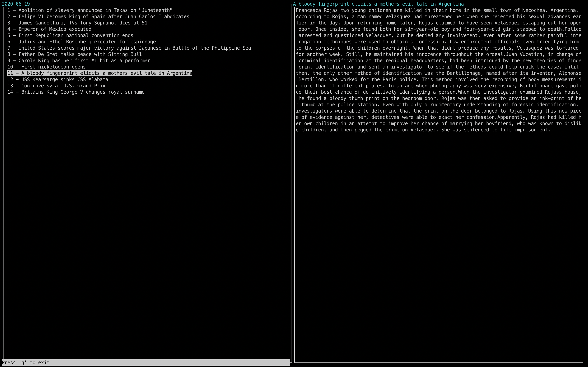

# histoday
A Python curses library based utility to read today in history

# Installation
Currently, it's only possible to install the package with `pip`. More installation options will come.

## 1. Option
`pip install histoday`

or if you use **pip3**

`pip3 install histoday`

## 2. Option
`python -m pip install histoday`

or if you use **python 3**

`python3 -m pip install histoday`
